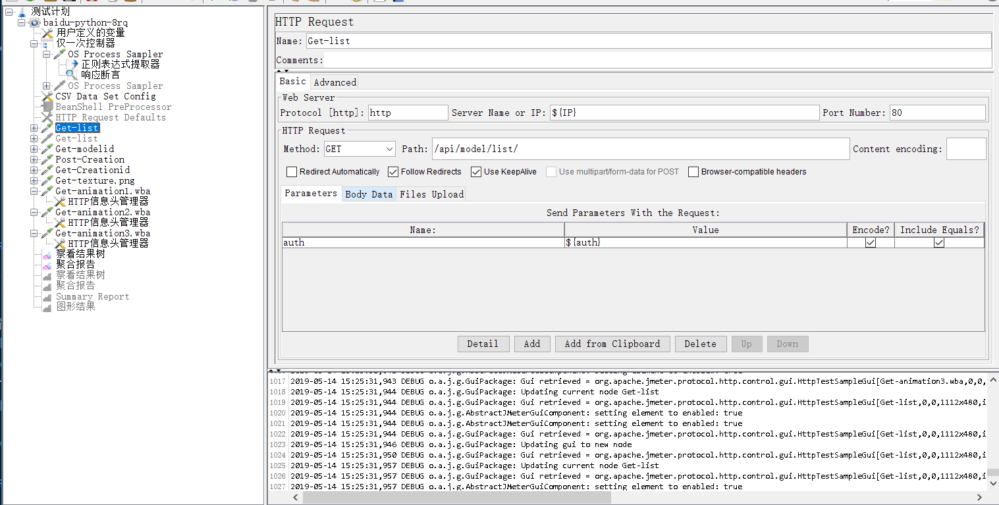

#Jmeter Plus_知识体系

## 目录

* [工具介绍及环境搭建](#part1)
* [Jmeter的使用](#part2)
* [实践举例 ](#part3)
* [踩过的坑](#part4)
* [可视化实时监控工具](#part5)
* [分布式部署](#part6)

## Jmeter + Jenkins + Ant
Jmeter是性能测试工具，能够对HTTP和FTP服务器进行压力和性能测试。它可以在Linux、Windows等平台搭建，并且其脚本可以跨平台使用。另外，Jmeter也能够与Jenkins、Ant等工具集成，形成持续集成的自动化测试平台。

<span id="part1"></span>
### 1. 工具介绍及环境搭建 

- Jmeter   
  - Jmeter 安装&各组件介绍 
    - https://www.cnblogs.com/imyalost/p/5790268.html 
  - Jmeter中文手册 
    - https://wenku.baidu.com/view/99145b32fbd6195f312b3169a45177232e60e441.html?rec_flag=default&sxts=1536889252023
  
- Jenkins + Ant + Jmeter 
  - Jenkins 入门系列 
    - http://www.liuhaihua.cn/jenkins
  - Jenkins + Ant + Jmeter 环境搭建以及配置Jenkins常用插件 
    - https://sq.163yun.com/blog/article/185875305801654272
    - https://blog.csdn.net/u011417723/article/details/78252963
  
- 安装Ant
  - 安装&配置
    - https://www.cnblogs.com/huangchanghuan/p/6597741.html
  - 本地调试build.xml时，还需在Ant中安装Jmeter插件
    - 将 jmeter下extras目录中ant-jmeter-1.1.1.jar包拷贝至ant安装目录下的lib目录中

<span id="part2"></span>
### 2. Jmeter的使用

#### 2.1 GUI模式
- 通常使用<HTTP请求>组件，来测试HTTP的相关请求（GET\POST） 

- GUI模式下，易于了解Jmeter各种Sampler的类型，选择适合自己的Sampler或其他组件使用。https://www.cnblogs.com/imyalost/p/5790268.html

#### 2.2 非GUI模式  
- 命令
```bash
# For load testing, use NON GUI Mode:
jmeter -n -t [jmx file] -l [results file] -e -o [Path to output folder]
# & adapt Java Heap to your test requirements:
# Modify HEAP="-Xms512m -Xmx512m" in the JMeter batch file
``` 

#### 2.3 Jmeter脚本
Jmeter脚本可跨平台使用，因此推荐脚本在本地调试通过后，再上传至远程Linux服务器运行。
- 脚本编写
    脚本是基于要测试的场景来编写的。例如，测试场景是网站登录功能在并发下的性能表现，那么“登录”场景则作为脚本要实现的功能，再加上Jmeter自带的多线程、多并发的功能，能够模拟登录场景。
- 脚本调试参考：https://www.cnblogs.com/hong-fithing/p/7668258.html

#### 2.4 配置文件
  在Jmeter的bin文件夹下，有名为jmeter.properties的文件，这是Jmeter的配置文件。在Jmeter使用过程中，推荐新建一个user.properties文件，将需要的参数放入此文件中，而不要改变jmeter.properties。
  - jmeter.properties 中的提示文字↓
  

#### 2.5 Jmeter 日志文件
jmeter日志主要有2种格式：**csv 和xml**。具体使用哪种格式作为jtl日志的格式输出，可根据自己需求来确定。
日志格式在jmeter.properties 或 user.properties 文件中指定。
`jmeter.save.saveservice.output_format=xml`

**xml的优势**
- 通过properties文件的详细选项设置，可以定制输出的日志内容，比如可以在error发生时记录response data，能够在出现问题时及时记录返回的错误信息，以便分析问题使用
- xml中的 httpSample 字段属性含义
    * t表示从请求开始到响应结束的时间
    * lt表示整个的空闲时间
    * ts表示访问的时刻
    * s表示返回的结果true表示成功，false表示失败
    * lb表示标题
    * rc表示返回的响应码
    * rm表示响应信息
    * tn表示线程的名字“1-138”表示第1个线程组的第138个线程。
    * dt表示响应的文件类型
    * by表示请求和响应的字节数
    * responseData表示返回数据
    * cookies表示cookie
    * method表示请求方式
    * queryString表示查询类型

**csv的优势**
* 设定为csv后能够在后续对jtl进行图形化处理（下一章节），生成图形报告
* csv相较xml来说，日志文件较小，占用空间少

#### 2.6 JMeter Dashboard Report 图形化结果
1. Jmeter支持图形化展示测试结果使用说明
   * 官方文档： [Apache JMeter Dashboard Report](http://jmeter.apache.org/usermanual/generating-dashboard.html)
   * 其他介绍：https://www.jianshu.com/p/be8930c4eef2

2. JMeter Dashboard Report的[配置要求](http://jmeter.apache.org/usermanual/generating-dashboard.html#saveservice_requirements)

3. 生成图形化结果的命令（<“log file”>必须是CVS格式）
`jmeter -g <log file> -o <Path to output folder>`  

#### 2.7 使用Ant执行Jmeter脚本
除使用Jmeter本身的命令执行Jmeter脚本外，还可以使用ant的相关命令执行Jmeter脚本。
- Ant命令集
  - http://www.cnblogs.com/jenniferhuang/p/3865132.html
- 命令举例
  ```bash
  cd D:\Tool\apache-jmeter-4.0\ant_demo # 进入配置好的build.xml文件路径下
  ant  #输入命令ant。如果要打印更多日志，可以使用命令： ant -debug
  ```
  


<span id="part3"></span>

### 3. 实践举例
#### 3.1 百度-神笔云

背景：百度使用神笔云开启AI小画家项目，并确定了7QPS吞吐量+2sec响应时间的性能指标。为验证神笔云的功能与性能指标，使用Jmeter进行测试。下面将从搭建Linux环境、脚本、Jenkins平台的配置等方面分享整个过程。 

**3.1.1 搭建环境** 
- 环境依赖  
  - JDK（Tomcat、Jenkins都是基于JAVA语言编写的） 
  - Tomcat （运行Jenkins的容器） 
- 安装Jmeter（Linux）
  - https://www.jb51.net/article/143296.htm
- 安装Jenins（Linux）
  - Jenkins直接使用.war包，将其部署在Tomcat中，可以直接运行。https://www.jianshu.com/p/24fe92b6a689
- 安装Ant （Linux）
  - https://blog.csdn.net/enson16855/article/details/51375855
- 安装python3（Jmeter脚本调用python）

**3.1.2 “百度-神笔云” 脚本**
  - 脚本流程：
    1. 获取登录服务器的身份认证的token值（在Jmeter中执行python脚本）  
    2. 通过CSV文件图片数据（用于支持POST请求输入各种图片的情形）
    3. 调用各功能接口
    4. 察看结果树：记录运行过程的请求信息
    5. 聚合报告：生成各接口的性能指标报告
  - 脚本参见 [WPCloud_test.jmx](./jmeter_script/WPCloud_test.jmx)

**3.1.3 Jenkins 使用说明**
- Build Environment。


- Build。需要配置ant的相关信息以及<build.xml>中Targets的名称。  
```xml
  <target name="208monitor">
        <antcall target="test" />
  </target>
```
  

- Publish Performance test result report。用于监控执行情况，如果有报错时，会产生失败的build。

  - 使用说明：https://dzone.com/articles/how-to-use-the-jenkins-performance-plugin

- Editable Email Notification。可以在Job触发某些场景时，设置发送邮件。
  - 配置参考：https://blog.csdn.net/houyefeng/article/details/51344337
  https://blog.csdn.net/u013066244/article/details/78665075


- Jenkins配置参考   
    - https://www.jianshu.com/p/512317eac26a  
    - https://sq.163yun.com/blog/article/185875305801654272   


<span id="part4"></span>

### 4. 踩过的坑
#### 4.1 Jenkins调用Python的问题

4.1.1 Jenkins 执行Jmeter脚本提示“系统找不到指定的文件”
  - 具体问题：使用Jenkins 运行 Jmeter脚本，脚本包含一个执行python 取样器，但是频繁报错（使用ant执行脚本不报错），脚本截图如下图。


```bash
# 报错信息
OS Process Sampler,500,"Exception occurred whilst executing system call: java.io.IOException: Cannot run program ""python3"" (in directory ""E:\Tool\apache-jmeter-4.0\bin""): CreateProcess error=2, 系统找不到指定的文件。"
```
  - 原因参考
    - https://stackoverflow.com/questions/15135771/hudson-on-windows-error-java-io-ioexception-cannot-run-program-sh  
    This happens if you have specified your Windows command as "Execute shell" rather than "Execute Windows batch command".

- 修改后的Jmeter脚本


4.1.2 Jenkins执行Jmeter脚本，日志中有python的报错。
- 具体问题：Jmeter脚本在Jenkins平台执行后，python部分报错，并且返回内容是乱码，无法看到完整提示信息。
```json
<responseData class="java.lang.String">&apos;python3&apos; ²»ÊÇÄÚ²¿»òÍⲿÃüÁҲ²»ÊÇ¿ÉÔËÐеijÌÐò&#xd;
»òÅú´¦ÀíÎļþ¡£&#xd;
```
- **问题分析**：python3 在Jenkins平台执行失败。推断是python3 不能被Jenkins识别。

- **原因推断**：
  - Jenkins 未读取到系统变量对python3 的定义
  - Jenkins 未安装python 插件

- **解决方案**：
  - Jenkins 运行期间，会读取系统变量信息。如果python只是设置了用户变量而不是系统变量，那么可能存在Jenkins读取不到python系统变量的情况，因而报错。所以需要设置系统变量。
    - Windows是环境变量-系统变量中配置
    - Linux是在/etc/profile 中配置
  - 系统安装了python，但是Jenkins中未安装python插件，也会报错。此问题的解决方案就是Jenkins安装python插件。

#### 4.2 邮件通知
- 邮件通知进行系统配置时，除Email配置外，一定要配置**系统管理员邮件地址**，否则Jenkins不知道用哪个邮箱发邮件。
- 系统管理员邮件配置错误时，使用Email Notified 功能测试时，会报错。
- 系统管理员邮件地址与SMTPServer配置的邮箱不一致时，也会报错。


<span id="part5"></span>

### 5. 可视化实时监控工具 

#### 5.1 简介 
  **Jmeter + InfluxDB + Grafana + Telegraf** 的组合，能实现实时监控Jmeter的压测情况，并且整合了系统资源的显示。通常测试人员关注的聚合报告中的内容，都可以使用此工具组合实时观测到，不用再等到测试完毕才能看到测试报告。  

  **Jmeter**：使用监听的方式，将监听到的http请求数据异步写入InfluxDB中。使用的是Backend Listener 来实现实时写入InfluxDB。

  **InfluxDB**：是一款用Go语言编写的开源分布式时序、事件和指标数据库，无需外部依赖。该数据库现在主要用于存储涉及大量的时间戳数据，如DevOps监控数据，APP metrics, loT传感器数据和实时分析数据。

  时序数据库：处理带时间标签（按照时间的顺序变化，即时间序列化）的数据，带时间标签的数据也称为时间序列数据。想象它就像一个sql表，其中时间是它的主键。

  **Telegraf**：是一个用Golang编写的代理程序，可以收集系统和服务的统计数据，并写入到InfluxDB。
  
  **Grafana**：是一个web端图形展示工具，能够从InfluxDB查询数据并展示出图表。
  * 官方模板库https://grafana.com/grafana/dashboards?dataSource=influxdb
  * Grafana支持influxDB 的好用模板推荐：
    * id 5496,使用 org.apache.jmeter.visualizers.backend.influxdb.HttpMetricsSender 对应的Jmeter脚本是：
   
    * id 1152，使用 JMeterInfluxDBBackendListenerClient，对应的Jmeter脚本是：
  

  

#### 5.2 工具的安装与配置

- 安装：https://www.golang123.com/book/46?chapterID=1206

#### 5.3 数据查看
1. 启动Grafana server，访问http://localhost:3000/login
2. Grafana中配置了influxDB 以及对应的数据库
3. 查看图形界面，即可看到图形数据的展示


<span id="part6"></span>

### 6. Jmeter分布式部署

>参考：https://www.cnblogs.com/suntingme/p/5995721.html  

#### 6.1 名词解释
- client    控制端。可使用GUI界面，负责编辑脚本；发送脚本给远程服务器。
- server（Slave）    服务器端，也是引擎端，负责真正执行Jmeter脚本。

#### 6.2 服务器（Slave）环境准备
- Jmeter5.1.1
- jdk8（运行Jmeter的基础环境）
- python3（神笔云Jmeter脚本需要调用python3，还需要配置python的环境变量：path）

#### 6.3 配置文件修改
- 配置Jmeter的properties

```properties
# 需要修改的字段，具体配置请参考以上链接
server_port
server.rmi.localport
server.rmi.ssl.disable
```

- 服务器的jmeter-server文件
```properties
# 指定服务器端的网卡ip
RMI_HOST_DEF=-Djava.rmi.server.hostname=XXX.XXX.XXX.XXX
```

#### 6.4 远程执行Jmeter脚本
```shell
# 运行所有服务器
jmeter -n -t D:\path_to_script\WPCloud_test.jmx -r

# 运行指定的服务器
jmeter -n -t D:\知识体系\Jmeter\jmeter_script\WPCloud_test.jmx -R 10.0.0.2:1234,10.2.3.156:1234
```